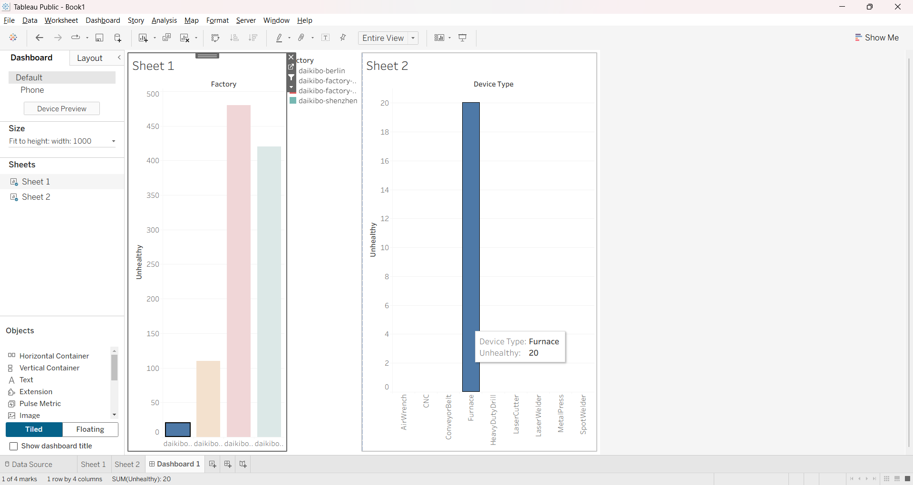
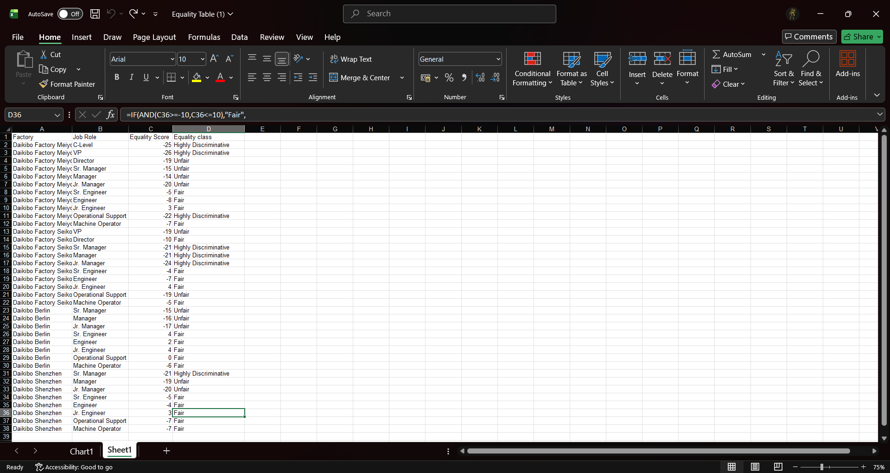

# Deloitte Data Analytics Virtual Job Simulation

## Overview

This repository contains my completed work for the Deloitte Data Analytics Virtual Job Simulation. The project focuses on analyzing manufacturing telemetry data, identifying machine downtime, and presenting business insights through Tableau and Microsoft Excel.


---

## Tools Used

* Tableau
* Microsoft Excel

---

## Tableau Project

### Objective

Analyze telemetry data collected from four Daikibo manufacturing factories to identify:

* The factory with the highest machine downtime.
* The machine types that contributed most to downtime.
* Business insights through an interactive dashboard.

### Dashboard Preview



---

## Excel Project

### Objective

Analyze and organize business data using Microsoft Excel to support data-driven decision-making.

### Excel Analysis Preview



---

## Skills Demonstrated

* Data Analysis
* Data Cleaning
* Data Visualization
* Dashboard Development
* Tableau
* Microsoft Excel
* Business Analytics
* Analytical Thinking

---

## Repository Structure

```text
Tableau-Project/
│── Daikibo_Downtime_Analysis.twb
│── tableau_dashboard.png

Excel-Project/
│── Equality_Table_Analysis.xlsx
│── excel_data_analysis.png

README.md
```

---

## Author

**Rohit Alone**
